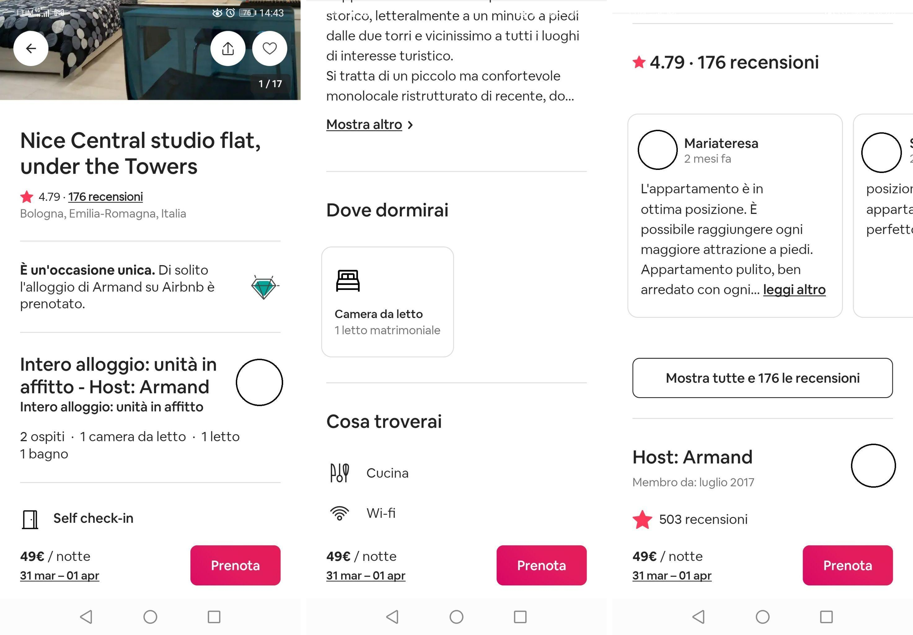

# Laboratorio Basi di Dati 2021/22

## Progetto di piattaforma di home booking

Si vuole realizzare una base di dati per un servizio che permette di affittare e prenotare alloggi di vario tipo ad esempio interi appartamenti, stanze private (camera privata e spazi comuni) e stanze condivise (spazio in comune e camera condivisa).[^1]

Gli utenti si registrano al servizio fornendo indirizzo email, password, nome, cognome, numero o numeri di telefono. Se l’utente fornisce la foto della carta d’identità, viene riconosciuto come verificato. Inoltre, l’utente deve indicare un metodo di pagamento per poter prenotare. Gli utenti possono essere ospiti o “host” ovvero possono a loro volta ospitare altri utenti del servizio in uno o più alloggi di loro proprietà. Inoltre gli “host” possono diventare “superhost” se soddisfano i seguenti requisiti:

- Devono aver completato almeno 10 soggiorni, per un totale di almeno 100 notti.
- Devono aver conservato un tasso di cancellazione dell'1% (una cancellazione ogni 100 prenotazioni) massimo.
- Devono aver mantenuto una valutazione complessiva di 4,8 considerando tutti i soggiorni in tutte le case di sua proprietà.

Gli utenti superhost ricevono un badge sul loro profilo.

Gli alloggi sono descritti indicando un nome, l’indirizzo (visibile all’ospite solo quando la prenotazione è confermata, altrimenti è visibile solo il comune), una descrizione, il prezzo per notte per persona e i costi di pulizia, delle foto, i servizi (ad esempio, cucina, wi-fi, lavatrice, ecc.), numero di letti e orario di check-in e check-out oltre all’host a cui appartiene, il rating medio e il numero di recensioni (vedere Fig. 1).

Gli utenti possono aggiungere alcune case tra i preferiti. Gli utenti possono avere diverse liste, ad esempio in base al viaggio che vogliono compiere.

Gli utenti possono prenotare degli alloggi di qualsiasi tipo indicando un intervallo di date per il soggiorno e il numero degli ospiti. Se gli ospiti sono a loro volta utenti del servizio, se ne possono indicare i nominativi. La prenotazione deve essere confermata o rifiutata dall’host. La prenotazione ha un costo totale e se confermata viene eseguito il pagamento. Inoltre, la prenotazione può essere cancellata sia dall’ospite che dall’host.

Fig. 1: Dettagli di un appartamento.

Al termine del soggiorno, gli ospiti e gli host si possono valutare a vicenda. La recensione fatta dagli ospiti comprende due testi (uno per l’appartamento e uno per l’host) e una serie di punteggi in una scala da 1 a 5 su dimensioni come pulizia, comunicazione, posizione, qualità/prezzo. La valutazione complessiva del soggiorno è una media delle valutazioni ricevute sulle singole dimensioni. Le recensioni degli host comprendono solo un commento testuale. Le recensioni possono essere visibili o non visibili. Diventano visibili quando entrambi hanno fatto la recensione oppure se uno dei due non ha fatto la recensione, l’altra diventa visibile dopo 7 giorni dalla fine del soggiorno. Gli host e gli ospiti possono commentare più volte le review in cui sono coinvolti, creando un thread di discussione.

Le recensioni sono visibili sui profili degli utenti suddivise in base a quelle ricevute come ospite e come host.

La base di dati deve supportare le seguenti operazioni:

- Una volta a settimana viene effettuato un calcolo per aggiornare il tasso di cancellazione di ciascun host.
- Una volta al giorno si controllano le condizioni per la qualifica di superhost e viene aggiornato lo status degli host.
- Una volta al mese viene calcolata la classifica degli alloggi più graditi.

[^1]: Il servizio descrizio è liberamente ispirato a Airbnb (https://www.airbnb.it/) a cui è possibile fare riferimento per completare e disambiguare i requisiti.
